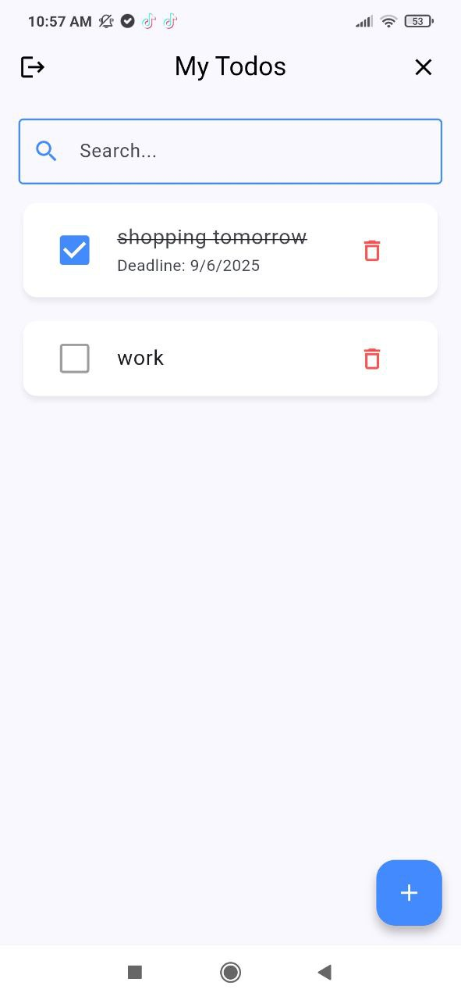
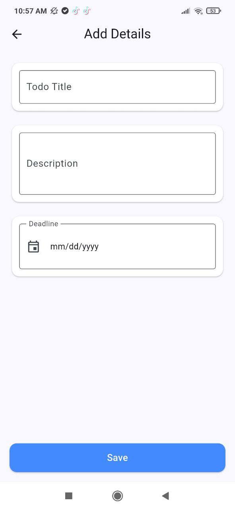
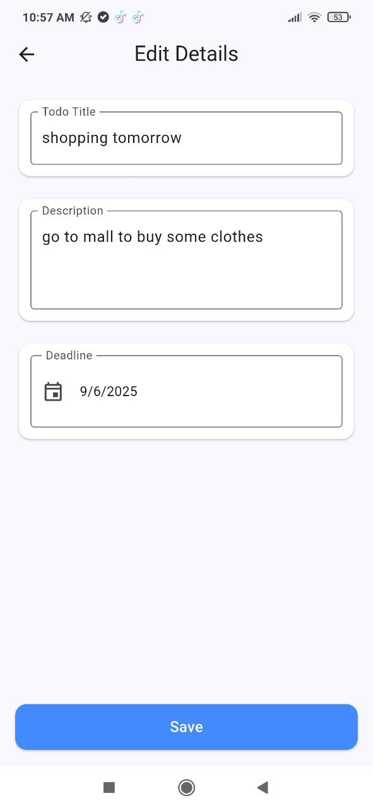
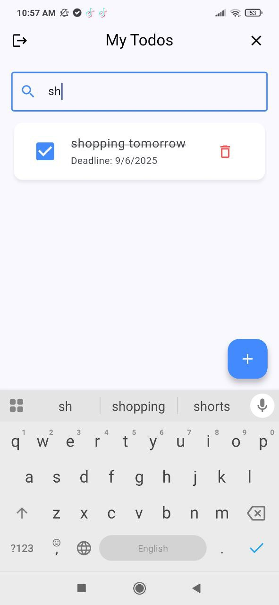

# 📝 New Todo App

A simple **To-Do application** for managing daily tasks (add, edit, delete, search) with a clean and user-friendly interface.

---

## 📸 Screenshots

 

  
 


---

## 🎥 Demo Video

[](https://youtube.com/shorts/bnh19zYko0Y)

---

## 🚀 Features

- User authentication (Login)
- Add new tasks
- Edit and delete tasks
- Search through tasks
- Simple and clean UI

---

## 🛠️ Installation

1. Clone the repository:
   ```bash
   git clone https://github.com/username/new_todo_app.git
